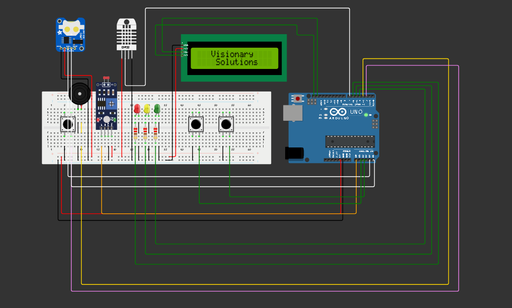

# 🍷 Vinheria Agnello - Projeto de Monitoramento Ambiental com Arduino

Este projeto tem como objetivo o **monitoramento ambiental inteligente de uma vinheria**, utilizando sensores conectados ao Arduino para medir temperatura, umidade e luminosidade, com interface em LCD e armazenamento em EEPROM. A ideia é garantir que as condições ideais para armazenamento de vinhos sejam mantidas, alertando visual e sonoramente em situações críticas.

O projeto foi desenvolvido como parte do **Checkpoint 2 da disciplina de Edge Computing** no curso de Engenharia de Software - FIAP (2025).

---

## 💻 Circuito

## ⚙️ Funcionalidades

- Monitoramento de **temperatura (DHT22)**, **umidade (DHT22)** e **luminosidade (LDR)**.
- Interface com usuário via **LCD I2C 16x2** e **3 botões físicos**.
- Sistema de **navegação por menus**: escolha entre os modos de visualização.
- Alertas visuais com **LEDs RGB** (verde, amarelo, vermelho) e sonoros via **buzzer**.
- Armazenamento de registros críticos em **EEPROM**, com:
  - Data e hora (RTC DS1307)
  - Temperatura, umidade e luminosidade (valores fora do intervalo ideal)
- Cálculo de **média de luminosidade** em tempo real (a cada 10s).
- Logo animado da “Visionary Solutions” na inicialização.
- Exibição do **status do ambiente** (OK, Alerta, Perigo).

---

## 🧰 Componentes Utilizados

| Componente           | Descrição                                  |
|----------------------|----------------------------------------------|
| Arduino UNO          | Microcontrolador principal                  |
| Sensor DHT22         | Mede temperatura e umidade ambiente         |
| Sensor LDR           | Mede nível de luminosidade                 |
| RTC DS1307           | Módulo de relógio de tempo real             |
| LCD 16x2 I2C         | Exibição de dados e menu                    |
| LEDs (RGB)           | Indicação de status visual                  |
| Buzzer               | Alarme sonoro em casos críticos             |
| EEPROM interna       | Armazenamento de dados críticos             |
| Botões (x3)          | Navegação no menu e seleção                 |
| Resistores diversos  | Para botões e sensores                      |
| Protoboard / Jumpers | Montagem do circuito                        |

---

## 📐 Esquema do Circuito

Você pode montar o circuito com base nos seguintes pontos:

- **DHT22:** VCC → 5V, GND → GND, Sinal → D7
- **LDR:** Em um divisor de tensão no pino A0
- **RTC:** SDA/SCL → A4/A5 (Arduino UNO)
- **LCD I2C:** SDA → A4, SCL → A5
- **Botões:** Pinos 2, A2, A3 com resistores pull-up internos
- **LEDs e Buzzer:** Pinos 4 (verde), 5 (amarelo), 6 (vermelho), 3 (buzzer)

---

## 🧠 Lógica do Sistema

- O sistema inicializa com uma **animação e logo personalizada**.
- Entra no menu de navegação onde o usuário escolhe o modo desejado.
- A cada leitura:
  - Luminosidade, temperatura e umidade são monitoradas constantemente.
  - O sistema verifica faixas ideais:
    - Luminosidade entre 0% e 30% (ideal)
    - Temperatura entre 10°C e 16°C
    - Umidade entre 60% e 80%
  - Se algum valor sair do intervalo ideal, o sistema:
    - Aciona LED correspondente 
    - Emite som no buzzer
    - Armazena o registro na EEPROM com timestamp

---

## 📂 Estrutura de Arquivos

cp2-edge-vinheria-agnello/
└── cp2-visionary-solutions
    ├── cp2-edge.ino               # Código-fonte comentado (Arduino C++)
    ├── diagram.json               
    └── img/                       # Prints do circuito e LCD
        ├── img-circuito1.png
        └── img-circuito2.png
├── README.md                # Este arquivo
├── libraries.txt            # Livrarias utilizadas
└── wokwi-project.txt        # Link para simulação no Wokwi

---

## 🧮 Organização da EEPROM

Cada registro ocupa **10 bytes**:

| Endereço       | Dados                       | Tipo   |
|----------------|-----------------------------|--------|
| +0 a +3        | Timestamp (Unix)            | `long` |
| +4 a +5        | Temperatura × 100 (int)     | `int`  |
| +6 a +7        | Umidade × 100 (int)         | `int`  |
| +8 a +9        | Luminosidade × 100 (int)    | `int`  |

> 💾 Máximo de 100 registros (1000 bytes dos 1024 disponíveis na EEPROM do UNO).

---

## 🗺️ Mapa de Menus

[Menu Inicial]
|
|---> LUM (Luminosidade)
| |--> % atual + status (OK / Alerta / Perigo)
| |--> Média dos últimos 10s
|
|---> UMI (Umidade)
| |--> % atual + status
|
|---> TEMP (Temperatura)
|--> °C atual + status

---

Botões:

- `Selecionar`: entra no modo atual
- `Próximo`: muda para a próxima opção
- `Voltar`: retorna ao menu

---

## 💡 Como Reproduzir

### Requisitos:

- Plataforma: Conta no Wokwi ou Arduino IDE
- Arduino UNO virtual
- Componentes listados acima

### Passo a Passo:

1. Acesse o link da simulação no [Wokwi](https://wokwi.com/projects/431522975301554177).
2. Copie o código para o editor de código.
3. **Monte o circuito** conforme descrito.
4. Abra o **Monitor Serial** (opcional) para visualizar logs.
5. Navegue pelo menu com os botões.
6. Teste os alertas mudando luz, calor e umidade.
7. Leia os registros da EEPROM via Serial.

---

## 🧪 Testes Realizados

- Teste de navegação de menus com debounce de botão
- Validação de leitura correta do DHT22
- Cálculo da média de luminosidade funcional
- Simulação de alertas (iluminação forte e calor)
- Leitura dos dados armazenados via `Serial.println`

---

## 🎥 Vídeo Explicativo

📺 Assista ao vídeo explicando o projeto: [Link para o vídeo]()

---

## 📎 Extras

- A média de luminosidade é exibida automaticamente no display a cada 10 segundos.
- Os dados da EEPROM podem ser exportados para .CSV para análise externa.

---

## 👨‍💻 Autoria

- Projeto desenvolvido por **Visionary Solutions** para a disciplina Edge Computing - FIAP.
- Equipe: Arthur Araujo Tenorio, Breno Gonçalves Báo, Rodrigo Cardoso Tadeo, Vinicius Cavalcanti dos Reis
- Professor: Dr. Fábio H. Cabrini

---

## 📢 Licença

Este projeto é livre para uso educacional. Para uso comercial, consulte os autores.